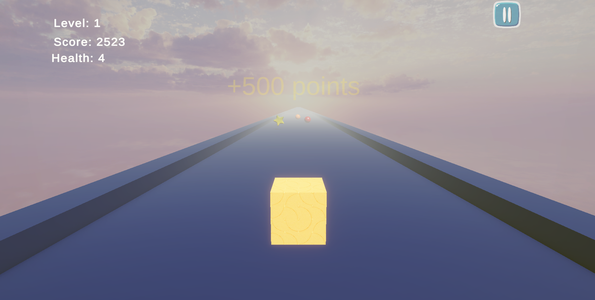
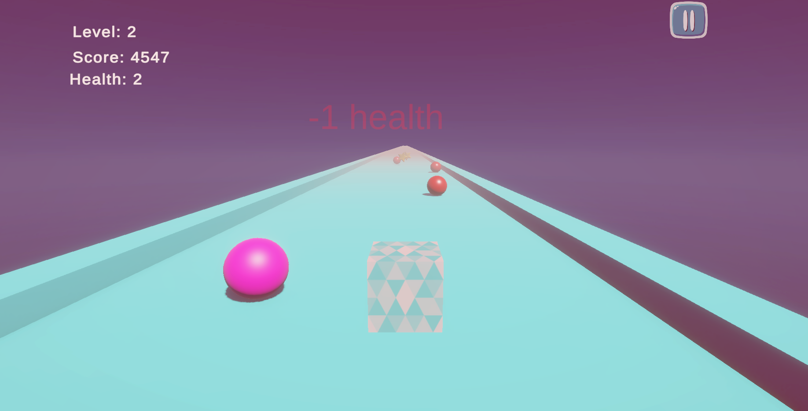
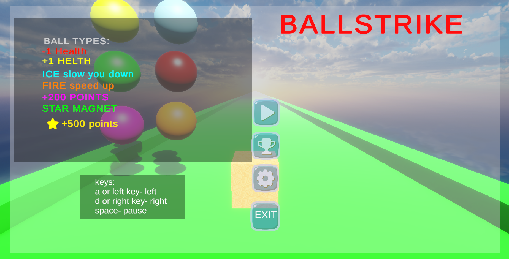

# 🎮 BallStrike

_A fast-paced 3D arcade dodging game built with Unity as part of the Master's degree in Computer Science at Azrieli College of Engineering._

**Lecturer**: Ben Tzvi Daniel  
**Course**: Unity Development  
**Engine**: Unity 2022+

---

## 🧠 Game Concept

**BallStrike** is a endless  game where the player speeds up every level and must avoid or collect various types of balls. It features checkpoints, leaderboard mode, and visual effects using Unity assets.

---

## 🌟 Game Modes

- 🌀 **Endless Mode**: Keep going forever with increasing speed. Respawn at last checkpoint.
- 🏆 **Normal Mode**: Compete for a high score and submit your name to the leaderboard.

---

## 🎯 Ball Types

| Ball  | Effect |
|------|--------|
| 🔴 Red Ball     | -1 HP (damage) |
| 🟡 Yellow Ball   | +1 HP (heal) |
| 🔵 Ice Ball     | Slows player|
| 🟠 Fire Ball   | Speeds player |
| 🟣 Points Ball  | +200 points |
| 🟢 Green Star   | Activates magnet to pull nearby stars |
| ✨ Star  | +500 points |

---

## 💡 Features

- 🧱 Checkpoint System
- 🏁 Level-based Speed Increase
- 🎨 skybox backgrounds
- 🧍 Player Skins
- 💾 Leaderboard with Name Input
- 💥 Visual Effects
- ⚙️ Cheats
- 🛒 Free Unity Asset Store integration
- 🎵 Dynamic in-game music and toggleable SFX

---

## 🖼️ Screenshots

